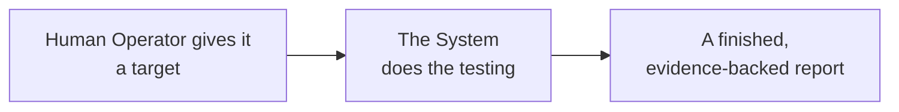
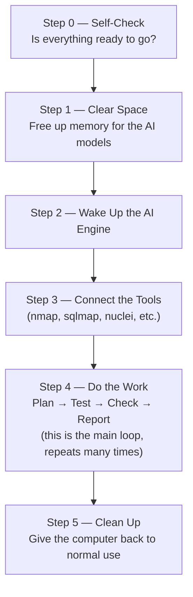
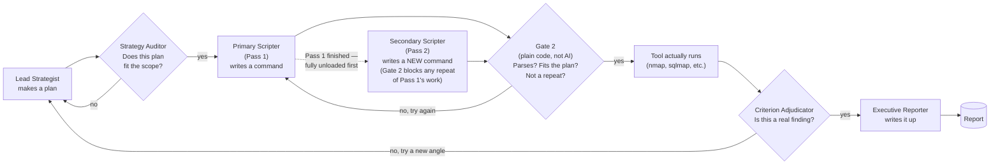
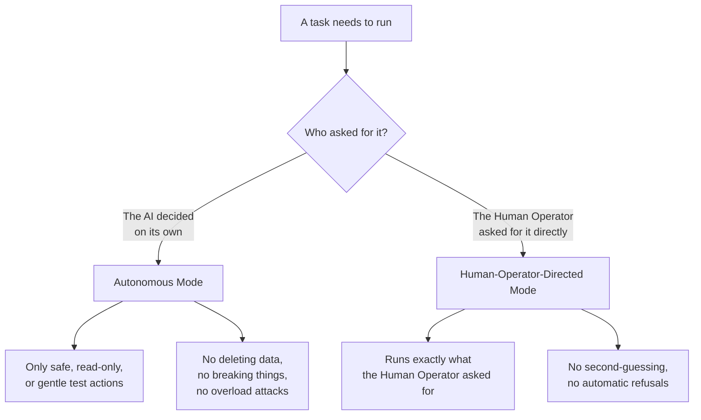
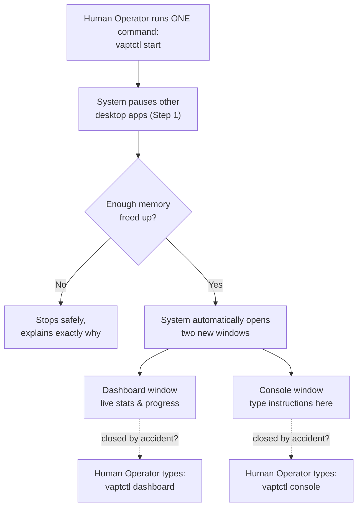

# Autonomous Agentic VAPT System — Management Blueprint & User Story

*A plain-English explanation of what this system is, how it works, and what it feels like to use it. For exact technical rules, see the numbered requirement documents (`01`–`24`); this document stays high-level on purpose.*

---

## 1. What Is This System, In One Sentence?

> **It's a robot penetration tester.** You give it a target and press start. It plans an attack, tests it safely, checks its own work, and hands you a finished, evidence-backed security report — all running on one local computer, with no cloud, no subscriptions, and no data ever leaving the building.

---

## 2. Why Does This Exist?

* **Penetration testing is expensive and slow** when it's done entirely by hand.
* **Cloud AI tools increases speed BUT raise privacy concerns , are too costly for Repetitive Testing & have Guardrails/Safeguarding Issues limiting the legitimate Cyber Security Work.**
* **This system solves these problems** by running a whole "team" of AI models locally, on ordinary laptop-class hardware, so even when testing is too slower than a Mainstream LLM, it is faster than Manual Testing, Easily Repeatable, and never leaves the machine it runs on.

---

## 3. The Big Idea: A Team, Not One Robot

Instead of one AI model trying to do everything (and fooling itself into believing its own mistakes), the system splits the work across **six specialist AI models**, plus **strict, non-AI safety rules** that no model is allowed to bypass on its own.

Think of it like a small security consulting firm, except every "employee" is a small AI model running on the same laptop, and they never all work at once — they take turns, one at a time, to save memory.

| Role                      | What They Actually Do                                                            | Plain-English Analogy                             |
| ------------------------- | -------------------------------------------------------------------------------- | ------------------------------------------------- |
| **Lead Strategist**       | Thinks up the attack plan and possible attack paths                              | The senior consultant sketching a game plan       |
| **Strategy Auditor**      | Checks the plan addresses the scope and makes sense (never decides scope itself) | The compliance officer signing off                |
| **Primary Scripter**      | Runs the standard, obvious tools first (`nmap`, `sqlmap`, etc.)                  | The hands-on tester at the keyboard               |
| **Secondary Scripter**    | Comes in *after* the Primary Scripter finishes, deliberately avoiding everything already tried, hunting for what a standard approach would miss | The specialist called in for the tricky, unconventional angle |
| **Criterion Adjudicator** | Decides whether a "finding" is real or a false alarm                             | The skeptical reviewer who won't let junk through |
| **Executive Reporter**    | Writes up the final report in client-ready language                              | The report writer who explains it clearly         |

*(Note: checking that a custom script isn't broken — missing a bracket, bad syntax —
used to be a seventh AI model's whole job. It's now just plain, ordinary code doing
that check instantly, for free, with zero chance of getting it wrong — no reason to
spend a model's time on something a simple program already does perfectly.)*

*(Exact model names, sizes, and memory footprints are technical detail — see `01`'s
Council Roster table if you need them.)*

---

## 4. How a Test Actually Runs: Six Simple Steps

* **Step 0 — Self-Check.** Before doing anything, the system checks its own tools, model files, and disk space are all present and healthy. If something's missing, it stops and says exactly what, instead of failing halfway through.
* **Step 1 — Clear Space.** Since the AI models need a lot of memory, the system politely pauses (not closes) other open desktop apps to free up room — think of it like putting other programs to sleep, not deleting them. They come back exactly as they were when the test finishes.
* **Step 2 — Wake Up the AI Engine.** The local AI engine starts up on the machine's own graphics chip — nothing is sent anywhere over the internet.
* **Step 3 — Connect the Tools.** The system wires up its security tools (the same tools professional testers use) so the AI can call them safely.
* **Step 4 — Do the Work.** This is the main loop, and it repeats over and over until the job is done. Inside this loop, the "team" from Section 3 hands work to each other in relay fashion:

That dotted line is the important part: the Primary Scripter (Pass 1) works through
everything obvious first, across every target. Only once it's completely done — fully
unloaded from memory, not just idle — does the Secondary Scripter (Pass 2) load in and
take over, hunting for what a standard approach would miss. It runs through that exact
same Gate 2 → Tool → Adjudicator → Reporter pipeline, just with a rule Gate 2 enforces
for it specifically: never repeat anything Pass 1 already tried.

* **Step 5 — Clean Up.** Once the job's done (or paused), the system frees the AI models from memory and un-pauses whatever desktop apps it paused in Step 1 — the Human Operator's desktop is handed back exactly as it was.

---

## 5. Staying Safe: Two Modes, One Simple Rule

The system only ever runs in one of two modes at a time, and the rule is deliberately simple:

* **Autonomous Mode** — when the AI is exploring on its own, it is only allowed to look and gently poke (read data, submit a harmless test form). It can never delete, break, or overload anything, and this is enforced by plain computer code, not by asking the AI nicely.
* **Human-Operator-Directed Mode** — when a Human Operator explicitly types a command, the system trusts that the Human Operator knows what they're doing (they hold legal authorization for the test) and carries it out exactly as asked, without an AI "gatekeeper" second-guessing them.

**Extra safety nets**, on top of the two modes above:

* Anything that comes back from the target (web pages, error messages) is clearly labeled "this is untrusted data" before the AI reads it — so a malicious website can't trick the AI into ignoring its own rules.
* Before a finding goes into the final report, the system double-checks that every fact in it can be traced back to real, saved evidence — no guessing allowed in the report.
* If testing keeps failing or finding nothing for too long, it automatically stops and moves to the next target instead of spinning its wheels.
* A short list of especially sensitive actions (like testing real login credentials) always pauses for a human "yes, go ahead" — unless the human is the one who typed the command in the first place.

---

## 6. Watching It Work: The Dashboard & Console

The Human Operator doesn't have to just wait and hope. Two live windows open **automatically** the moment a test starts — no extra commands needed:

* **The Dashboard** is a read-only screen showing live progress: which AI is "thinking" right now, how much memory is free, how many findings so far, and a rough time estimate for what's left.
* **The Console** is where the Human Operator can type instructions mid-run — e.g. "focus only on the login page" — and that instruction runs alongside whatever the AI was already doing, jumping to the front only if the two ever need the same AI's attention at the same moment.
* **If a window gets closed by accident**, the Human Operator doesn't need to restart anything — they just type `vaptctl dashboard` or `vaptctl console` again to bring it right back.
* **The system never fails silently.** Every known problem — from "ran out of memory" to "couldn't reach the target" — is looked up in a fixed dictionary of known issues, so the Dashboard and Console can show the Human Operator a plain-English reason, not a cryptic code. Anything serious enough to pause or stop the test gets a loud, impossible-to-miss banner, not just a line buried in a scrolling log — and if neither window happens to be open when it happens, that banner is still the first thing shown the next time one is opened.

---

## 7. Beyond the Basics: What Else Can It Test?

Past ordinary websites and networks, the system also plugs into more specialized testing areas:

* **Smart contracts** — reviewing blockchain application logic for flaws.
* **Mobile apps** — intercepting traffic and inspecting how an app behaves at runtime.
* **GraphQL APIs** — a modern API style with its own specific weak points.
* **CI/CD pipelines** — the automated build/deploy systems companies use, which are increasingly a target themselves.
* **Source code repositories** — reading actual application code to spot bugs a black-box test would miss.

---

## 8. The Hardware It Runs On

No special server room, no cloud bill — this runs entirely on one machine:

* **A single laptop-class computer** (Intel Core Ultra 5, integrated graphics) — the kind of machine already sitting on a tester's desk.
* **~15 GB of memory**, carefully managed so the AI models take turns rather than all loading at once.
* **Kali Linux** — the standard operating system security professionals already use.
* **Nothing leaves the machine** — no cloud AI calls, no telemetry, no external logging, unless the Human Operator deliberately configures it that way.

---

## 9. Detailed User Story — A Day With the System

*Told from the point of view of the Human Operator — the human penetration tester running the tool.*

### Meet the Human Operator

The Human Operator is a penetration tester who has legal permission to test a client's systems. They are always in charge — the system never acts outside what the Human Operator has scoped or asked for. Their job in this story is simply to point the system at a target and stay available in case it needs a quick decision.

### Before Starting Anything

* The Human Operator makes sure they have written authorization to test the target (this system doesn't check that for them — that responsibility always stays with the human).
* They write down the target's IP addresses or web domains, and any rules of engagement (e.g. "don't touch the payment server").
* They can also leave a short written note for the AI planner to read before it starts — e.g. "focus on the login flow first" or "don't touch the payment server" — typed straight into the start command. It's optional, and deliberately kept short: these are small AI models, not ones built to read a whole briefing document, so a long note gets rejected with a clear message asking for something shorter, rather than being silently cut off and half-ignored.
* They run one command to check the system itself is healthy — model files present, tools installed, enough disk space. If anything's wrong, the system tells them exactly what, before wasting any time.

### Starting the Engagement

* The Human Operator types a single command: `vaptctl start`, with the target list attached.
* They don't need to do anything else — no extra setup steps, no second command to open a monitoring window.
* Within moments, other desktop apps are gently paused to free up memory, and — as soon as that's confirmed safe — a **Dashboard** window and a **Console** window pop open automatically, side by side, ready to watch.

### Watching the System Work

* The Human Operator glances at the Dashboard now and then: which AI model is active, how many tasks are queued, how many possible findings have turned up so far.
* They don't have to babysit it — the system is designed to run unattended for hours if needed, always staying inside its non-destructive safety rules while it explores on its own.
* If something interesting shows up (say, a login page is found), the Human Operator can just watch it happen live in the Console's running commentary.

### Stepping In When Needed

* At any point, the Human Operator can type into the Console — for example, "focus on `/api/v2` only" — and that instruction runs alongside whatever the AI was already doing, not instead of it. The pre-planned work keeps going in the background; the Human Operator's instruction just jumps the queue and goes first whenever the two would otherwise need the same AI's attention at the same moment.
* If the Human Operator directly asks for something sensitive (like testing real login credentials against the target), the system just does it — because a human explicitly asked, no extra confirmation dialog gets in the way.
* If the *AI itself* stumbles onto something sensitive on its own (without being asked), it pauses and waits for the Human Operator to say "yes, continue" first — sensitive actions are only ever fully automatic when a human directly requested them.

### If Something Goes Wrong

* If the Human Operator accidentally closes the Dashboard or Console window, nothing is lost — they just type `vaptctl dashboard` or `vaptctl console` again, and it reopens showing the same live engagement.
* If the Human Operator needs to step away entirely, they run `vaptctl pause` — the system finishes whatever single step it's mid-way through, then stops cleanly, keeping everything it's learned so far.
* Coming back later, `vaptctl resume` picks up exactly where it left off — nothing is repeated, nothing is lost.
* If something needs to stop immediately, `vaptctl abort` halts everything within seconds, and desktop apps are handed back to the Human Operator right away.
* If something fails very early — before the Dashboard or Console have even opened yet, during the initial health checks — the system doesn't hide behind a vague summary. It prints the full technical detail straight to the same terminal window, since at that early point a bit of verbose detail is exactly what's useful, not noise.
* Whatever stopped the run, `vaptctl status` always gives a specific, plain-English reason — never just "something went wrong."

### Getting the Final Report

* Once testing is done, the **Executive Reporter** AI drafts a report — but every single fact in it has already been double-checked against real, saved evidence before the Human Operator ever sees it.
* The Human Operator reviews the draft, and approves it before it's turned into a final client-ready document.
* The report includes full, unredacted evidence (like the exact tokens or requests used to prove a bug) — nothing is hidden or watered down, since this is an internal engineering/testing tool, not a public-facing summary.

### After the Engagement

* The Human Operator's desktop is exactly as they left it — every paused app resumes right where it was.
* All the raw evidence, logs, and the final report stay saved locally, ready for the next time this same target needs a re-test (the system remembers past findings, so a re-test only highlights what's *new* or *changed*, not everything all over again).
