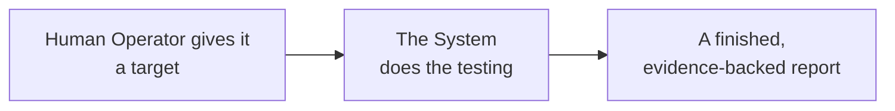
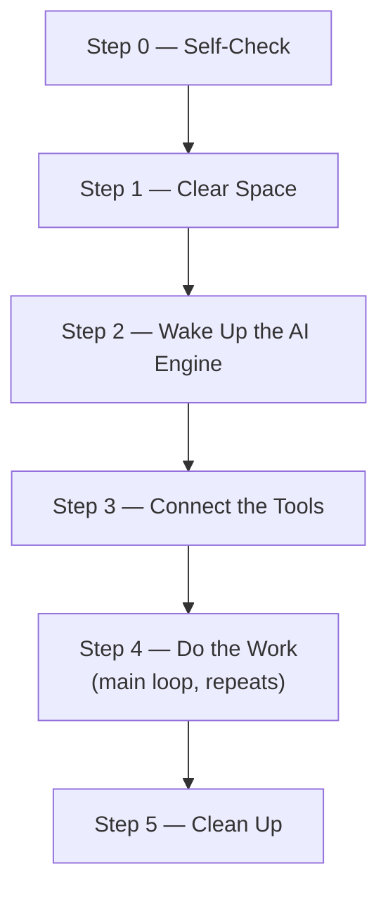
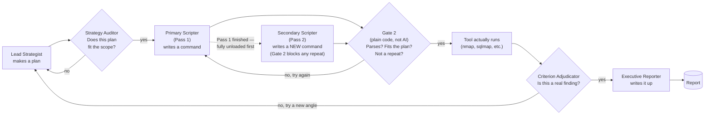
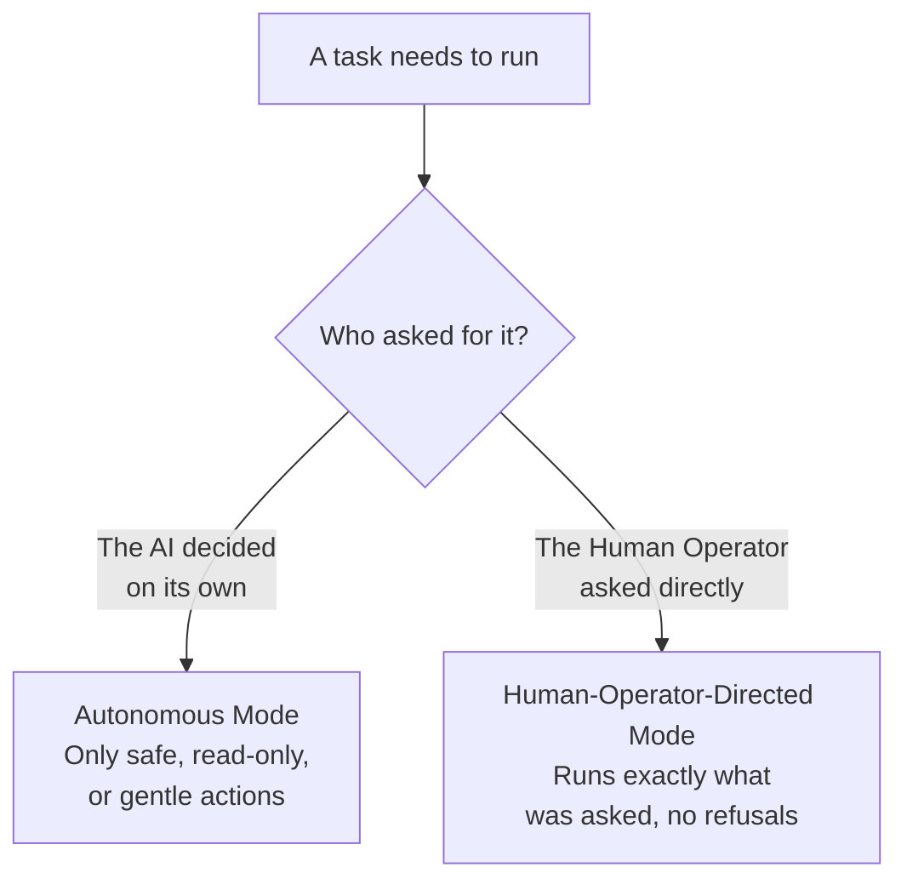
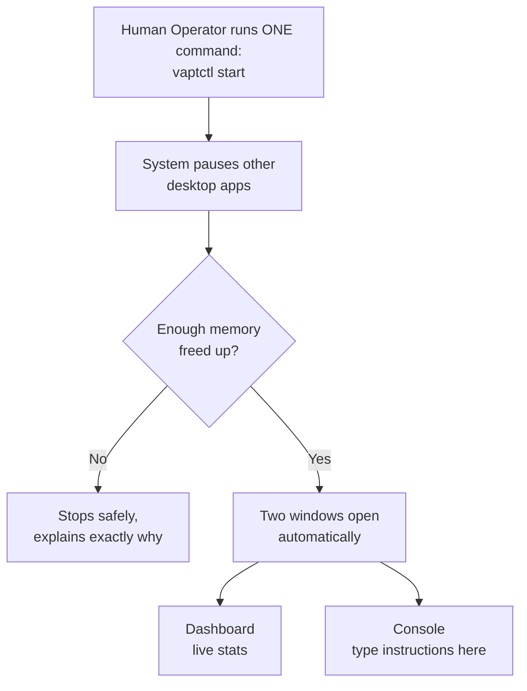

# Autonomous Agentic VAPT System

> **A robot penetration tester.** Give it a target and press start. A council of six local AI models plans an attack, tests it safely, checks its own work, and hands you an evidence-backed report — all on one local machine, no cloud, no subscriptions, nothing leaving the building.

*Full details live in [`Agentic VAPT Setup (HOME).md`](<Agentic VAPT Setup (HOME).md>) and the numbered requirement docs (`01`–`24`). This README is deliberately just the concept, the diagrams, and the user story.*

---

## The Concept

Instead of one AI trying to do everything (and fooling itself into believing its own
mistakes), the work splits across six specialist models that never run at the same
time — planning, auditing the plan, running tools, running a second orthogonal pass,
judging findings, and writing the report — plus strict non-AI safety code no model can
bypass.

## How It Runs

<!-- SYNC NOTE: this diagram is a deliberate copy of the council-relay diagram in
     "Agentic VAPT Setup (HOME).md" (Section 4) — README.md is self-contained by design
     (see its own intro note), so it can't just link to HOME.md's copy. If you change one,
     change both, or they will drift. -->

## The User Story

*Told from the Human Operator's point of view — the penetration tester running the tool.*

- **Before starting** — confirms authorization (the system doesn't check this for them), notes the target and rules of engagement, optionally leaves a short guidance note for the AI planner, and runs a health check.
- **Starting** — one command, `vaptctl start`. That's it — Dashboard and Console open on their own once it's safe to.
- **Watching it work** — no babysitting required; it runs unattended for hours inside its non-destructive rules, narrating live in the Console.
- **Stepping in** — typing into the Console runs alongside whatever the AI is already doing, not instead of it; it only jumps the queue on a genuine conflict. Anything the Human Operator directly asks for executes immediately, no confirmation dialog.
- **If something goes wrong** — nothing fails silently. A closed window just reopens with `vaptctl dashboard`/`vaptctl console`; `pause`/`resume` picks up exactly where it left off; `vaptctl status` always gives a specific, plain-English reason, never a shrug.
- **Getting the report** — every fact is checked against saved evidence before the Human Operator ever sees the draft; nothing is redacted or watered down.
- **After** — the desktop is handed back exactly as it was, and everything learned is saved for next time.
